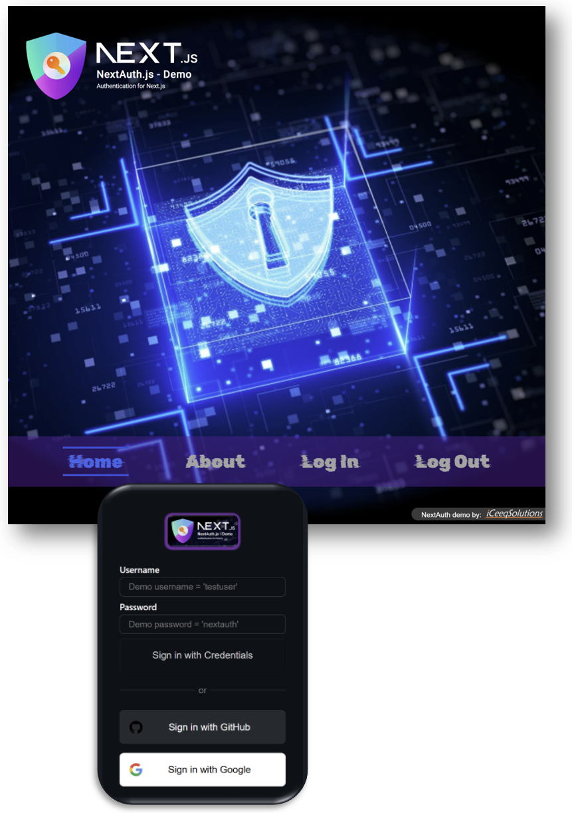

# NextAuth Demo - Next.js/React/TypeScript/Tailwind

  NextAuth Demo by <a href="https://iceeqsolutions.fi/">iCeeqSolutions</a>

## About

The NextAuth demo is a brief introductory project on how NextAuth works and how it can be used in larger projects to restrict unauthorized users from accessing information on specific pages. NextAuth includes OAuth and can be used with multiple providers such as GitHub, GitLab, Facebook and Google. In this demo we've included GitHub and Google. In addition to this, you can naturally connect NextAuth with a database and acquire the credentials from there to verify that the user is authorized. We did not include the database in this mini project - instead we hard-coded the user credentials so that this part can be tested as well.

To test out the demo, you can thus either use the test credentials "testuser/nextauth", or use OAuth and sign in via your GitHub or Google account.

For styling, we've used Tailwind where we added some custom configurations in the tailwind.config.ts file.

## Demo

👁️ [Live Demo](https://next-auth-demo-swart.vercel.app/)

## Built with

- Next.js
- NextAuth
- TypeScript
- React
- Tailwind
- Prettier

## Features

- Authentication
- OAuth
- Tailwind custom config

  

  
